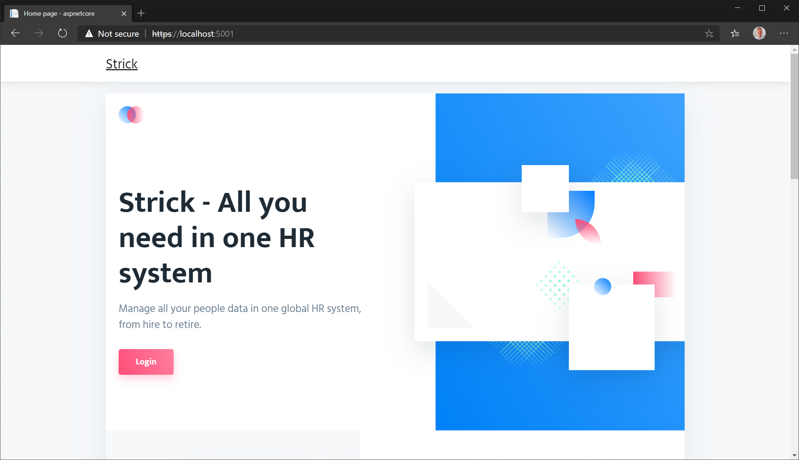

# Sample asp.net core application

This demo application is a single static web app. The application represents an hr web solution. The app is called **strick**.




The folder contains

- the source code for the asp.net core app
- the content for the website
- a multi-stage ```/Dockerfile``` to build the app container
- a ```/helm-chart/strick/``` folder that contains a sample helm chart for deploying the app.

## Run the app locally
Before you can run the app locally, ensure you have the [**.net core SDK**](https://dotnet.microsoft.com/download) installed. 

Clone the repository, switch to the ```/src/sample-apps/aspnetcore``` path of the local clone in a terminal and execute ```dotnet run```. 

The app will be started and listening on https://localhost:5001. Opening that url in your browser will open the webpage.

## Build the container
Before you can build the container, ensure you have the [**docker engine**](https://docs.docker.com/install/) installed and running.

In a terminal, switch to the ```/src/sample-apps/aspnetcore``` path of the local repository clone and execute 

```
sudo docker build -t your_registry_name/strick . 
```

The . specifies that the build context is the current directory.

Once the image is build, you can run the container with

```
sudo docker run --name strick -p 443:5001 -d your_registry_name/strick 
```
If you now browse to port 443 of the IP address of the docker host you will get the webpage (note the cert prompt, as the cert is self-signed).

## Deploy to Kubernetes with Helm
Obviously this procedure requires access to a Kubernetes cluster. Additional you will need to have [Helm](https://helm.sh/docs/intro/install/) installed.

Before you deploy the Helm chart, ensure you update the ```/helm-chart/strick/values.yaml file``` to reflect your environment. In particular the ```.image.repsotiory``` and ```.ingress.hosts.host``` sections.

The procedure to install the Helm chart can be found [here](https://helm.sh/docs/helm/helm_install/)

